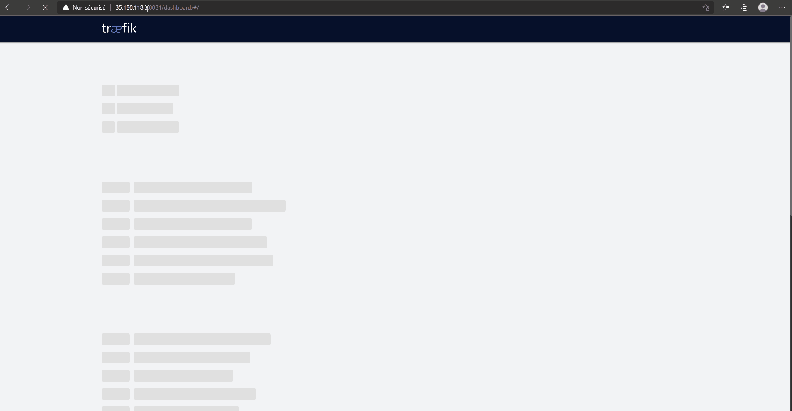
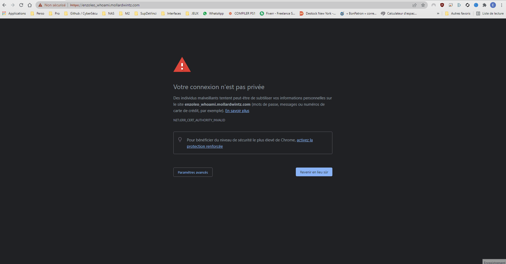
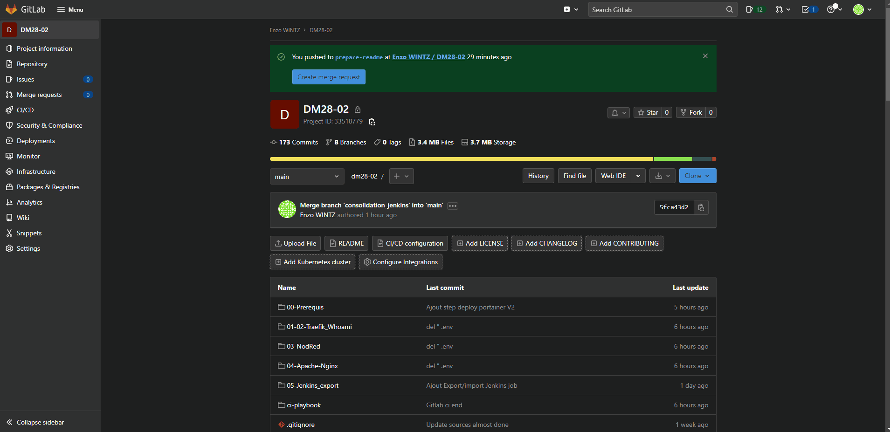
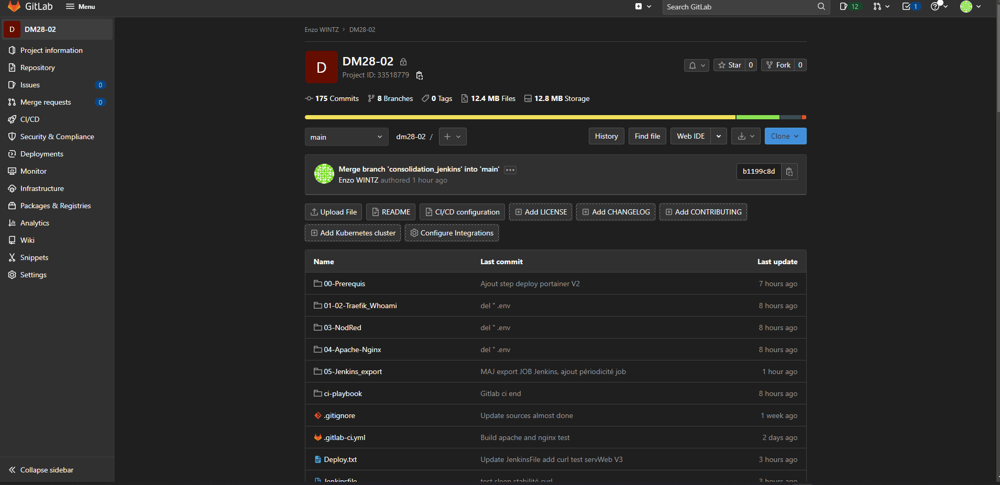
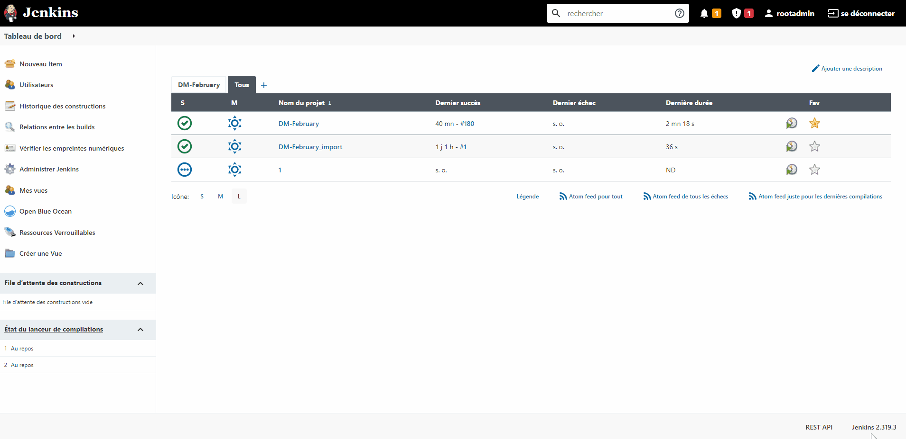
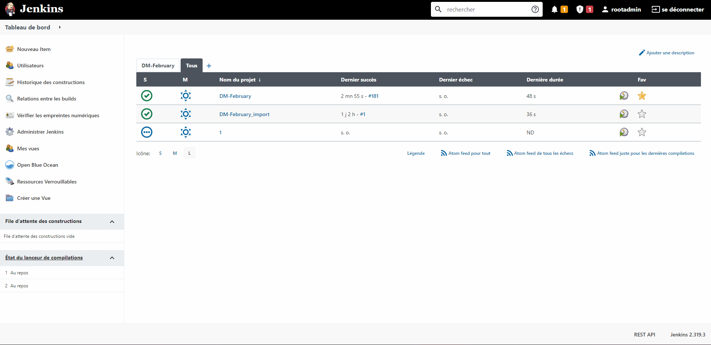
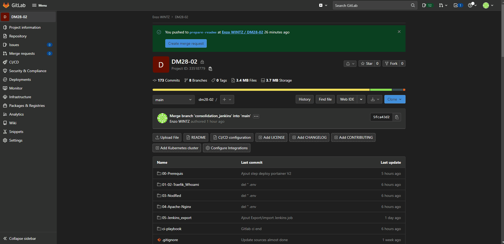

# DM28-02
# Réponse au devoir Maison CICD Février 2022
## Binôme : **Enzo Wintz** et **Léo Mollard**

### Environnement

L'ensemble du devoir s'est effectué sur une instance EC2 sous debian pour des raisons d'accessibilités.

## Etapes

## Etape 0 : Les prérequis
### Edit du fichier ```/etc/hosts```

Dans le fichier ```/etc/hosts``` ou si on est sur Windows comme pour les test, il faudra modifier le fichier se trouvera dans ```C:\Windows\System32\drivers\etc``` et y mettre les renseignements suivant : 

```bash
IP_Publique_De_l_Instance enzoleo_whoami.mollardwintz.com #en https 
IP_Publique_De_l_Instance enzoleo.mollardwintz.com  #Traefik en http sur le port 8081
IP_Publique_De_l_Instance enzoleo.srvnodred.com #NodRed en http sur le port 1880
IP_Publique_De_l_Instance enzoleo.mollardwintz.com #Serveurs apache et nginx en load balancing en https
```

### Installation des technologies nécessaires

Pour permettre la réalisation de ce devoir, il est nécessaire d'effectuer une certaines configuration et cela passe par des prérequis : 

- Installation de **Docker** : Dans le dossier ```00-Prerequis/00-docker``` se trouve un script permettant l'installation de **Docker** et **docker-compose**.

- Installation de **Portainer** : Dans le dossier ```00-Prerequis/01-portainer``` se trouve les élements de configuration pour installer Portainer, Portainer sera utilisé pour administrer les différents conteneurs et avoir une vision globale de l'envionnement.

- Installation de **Gitlab-Runner** : Dans le dossier ```00-Prerequis/02-gitlab-runner``` se trouve le script de configuration qui installera Gitlab-runner sur notre instance EC2, le choix de cette solution a permis de régler certains soucis de stabilité ou de communication entre Gitlab et notre runner **linux-sddc**.

- Installation de **Jenkins** : Dans le dossier ```00-Prerequis/03-jenkins``` se trouve les éléments de configurations qui permettent de monter un Jenkins en tant que conteneur (à noter que _docker_ et _docker-compose_ ont été installés sur le conteneur).

### Création du réseau __web__

Il est nécessaire avant de build les conteneurs ou d'exécuter la chaine CI / CD d'effectuer la commande qui va créer notre réseau _web_ qui sera utilisé par l'ensemble de nos conteneurs : 

```bash
 docker network create web
```

### Etape 1 et 2 : Traefik et Whoami

Les éléments de configurations liés à **Traefik** se trouvent dans le dossier ```01-02-Traefik_Whoami```.

En ayant créé au préalable de réseau _web_, nous pouvons effectuer la commande :

```bash
docker-compose up -d
```

Nous pouvons voir que notre instance **Traefik** est build et accessible depuis l'adresse IP _https://Ip-Publique:8081_

Les requêtes reçues sont sur le port _8081_ mais elles sont redirigées vers le port 8080 de Traefik comme en témoigne le GIF ci-dessous : 



De plus, nous pouvons voir que notre instance **Whoami** est build et accessible depuis l'url _https://enzoleo_whoami.mollardwintz.com_



### Etape 3 : Node-Red

Les éléments de configurations liés à **Node-Red** se trouvent dans le dossier ```03-NodRed```.

Il sera nécessaire de créer un dossier qui accueillera notre volume partagé, pour ce faire, il faudra exécuter la commande : 

```bash
mkdir node-red && chmod 777 node-red
```

Une fois notre dossier créé, nous pouvons effectuer la commande :

```bash
docker-compose up -d
```
  
Nous pouvons accéder à notre instance depuis l'url _http://enzoleo.srvnodred.com:1880_ et une fois dessus, nous aurons l'affichage suivant : 


### Etape 4 : Apache et Nginx

Les éléments de configurations liés à **Apache et Nginx** se trouvent dans le dossier ```04-Apache-Nginx```.

Nous retrouverons dans les dossier ```apache``` et ```nginx``` les _Dockerfile_ ainsi que les fichier _index.html_ servant à afficher un message personaliser selon le serveur auquel nous souhaitons accéder.

Afin de pouvoir rendre opérationnel nos serveurs web, en restant dans le dossier ```04-Apache-Nginx```, nous exécutons la commande : 

```bash
docker-compose up -d
```

Nous pouvons accéder à notre serveur web en passant par **Traefik**, et ainsi nous serons redirigés soit sur le serveur web _Apache_ ou _Nginx_ depuis l'url _https://enzoleo.mollardwintz.com/_ : 


## CI / CD

**90 %** des étapes précédemment évoquées sont retranscrite à travers des chaines CI / CD notamment au sein de **Gitlab** et **Jenkins**.

### Images push dans le registry

Depuis **Gitlab** ou **Jenkins**, nous pouvons push nos images de serveurs web au sein de notre registry gitlab comme en témoinre le .gif ci-dessous : 



### Etape 5 : Gitlab

À la racine du projet se trouve le fichier ```.gitlab-ci.yml``` permettant de jouer l'ensemble des différents éléments qui constituent notre infrastructure, ce fichier fait directement référence aux différents _stages_ présent dans le dossier ```ci-playbook``` dont les éléments sont : 

- ```deploy-portainer.yml``` : Permettant de déployer **Portainer**.

- ```traefik.yml``` : Permettant de déployer **Traefik**.

- ```nodred.yml``` : Permettant de déployer **Node-red**.

- ```test.yml``` : Permettant de vérifier la présence du fichier _docker-compose_ permettant de déployer nos serveurs web.

- ```nginx-build.yml``` : Permettant de _build_ et de _push_ l'image dans le registry **Gitlab** de notre serveur **Nginx**.

- ```apache-build.yml``` : Permettant de _build_ et de _push_ l'image dans le registry **Gitlab** de notre serveur **Apache**.

- ```deploy.yml``` : Permettant de déployer nos serveurw Web **Apache** et **Nginx** lors de la détection d'un commit _build_ ou de détruire les serveurs web lors de la présence du mot _destroy_ dans le commit.

- ```check.yml``` : Permettant d'effectuer les requêtes curl vers notre url géré par **Traeffik** qui s'occupera de rediriger ces requêtes vers nos serveurs web.

Nous avons donc la possibilité de construire ou de détruire l'infrastructure à partir des _Schedules_ ```Destroy Infra``` et ```Deploy infra before build```.

Le build et le déploiement des serveurs web se fait grâce à un commit en utilisant le mot **build** on peut aussi les détruire en faisant un commit **destroy**.




### Etape 6 : Jenkins
#### Prérequis : Liaison entre Jenkins et le repo Gitlab

Afin de permettre à **Jenkins** de pouvoir récupérer les sources depuis Gitlab, il a fallu créé une clé dans _Access Tokens_ dans les paramètres de mon compte avec comme droits : _api_.

##### Partie 1 : Dans Jenkins

Une fois cela fait, il faudra se rendre dans Jenkins et remplir dans les champs de connexions dans les paramètres système : 



##### Partie 2 : Dans Jenkins

A la suite de cela, il est nécessaire d'aller dans les paramètres du projet et de renseigner les informations de notre répertoires **Gitlab** tel que les informations d'identifications (On renseignera dès lors notre ID de compte et la clé créée précédemment).

Dans ce même projet, nous avons renseignés un rebuild du projet tous les jours : 



##### Partie 3 : Dans Gitlab

Au sein de **Gitlab**, il a fallu se rendre dans ```Settings/Integrations``` et sélectionner _Jenkins_ et y renseigner les informations de notre serveur : 



#### Chaine CI / CD 

À la racine du projet se trouve le fichier ```JenkinsFile```.

Au sein de ce fichier se trouvera l'ensemble des _stages_ et des sous _stage_ permettant les étapes suivante : 

- Stage **Deploy portainer** : Permet de déployer notre conteneur Portainer.

- Stage **Build de Traefik et Whoami** : Permet de déployer les conteneurs _traefik_ et _whoami_ ainsi que la préparation de certains éléments de configuration, une vérification du ```docker-compose.yml``` est faite afin d'éviter une interruption de la chaine lors de son exécution.

- Stage **Deploy de NodRed** : Permet de déployer le conteneur _nodred_ si la présence du fichier ```docker-compose.yml``` existe.

- Stage **Connect,Build Nginx image and push it to registry** : Permet de _build_ les images des serveurs web ainsi que de les _push_ sur le **registry gitlab**.

- Stage **Build des instances web** : Permet de déployer nos conteneurs Web à partir des images créées précédemment.

- Stage **Curl ServWebs** : Permet d'afficher le contenu de retour d'une requête curl vers notre serveur web.

Pour ce dernier _stage_, il faut au préalable ajouter dans le fichier ```/etc/hosts``` du conteneur Jenkins les informations suivantes :

```bash
IP_Publique_De_l_Instance enzoleo.mollardwintz.com

```

## Exécution de la chaine CI / CD Gitlab

### Déploiement _Portainer_, _Traefik_ et _Nod-Red_

Vous pouvez retrouver la vidéo montrant les différentes étapes à la suite de l'exécution du Schedule **Deploy infra before build** dans le dossier ```XX-Illustrations/04-Gitlab-Deploy.mp4```. 

### _Build_ et _Deploy_ des serveurs Web avec les vérification nécessaires.

Vous pouvez retrouver la vidéo montrant le _Build_, le _Push_ dans le registry **Gitlab** ainsi que le déploiement des serveurs Web à la suite de la présence du mot _build_ dans un commit au sein du dossier ```XX-Illustrations/05-Gitlab-Deploy-web_serv.mp4```. 

### BONUS : Destroy de l'infrastructure

Vous pouvez retrouvez la vidéo mettant en avant le Schedule **Destroy Infra** permettant la destruction de l'ensemble des élements de l'infrastructure dans le dossier ```XX-Illustrations/06-Gitlab-Destroy-web_serv.mp4```. 

## Exécution de la chaine CI / CD Jenkins

Vous pouvez retrouver la vidéo montrant le déroulement de l'exécution de la chaine CI / CD depuis **Jenkins** dans le dossier ```XX-Illustrations/jenkins-ci-cd.mp4```.


