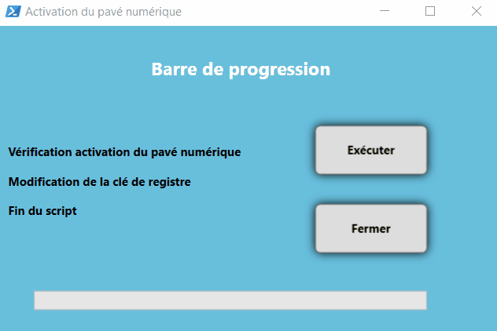

# BDF Tools

Interface principale
=========


Barre de progression
=========


Présentation du Projet BDF_Tools
=========

Le projet __BDF_TOOLS__ s'illustre dans le cadre de mon alternance au sein de la Banque De France.

Son but est de fournir aux techniciens de proximité un outil permettant la résolution rapide de certains incidents.

Comment est construit le projet ?
=========
Le projet se contruit à l'aide de l'utiliation de __WPF__ ainsi que d'une dll permettant de construire un menu de type Radial (utilisation de la dll __RadialMenu.dll__).

De plus pour les différents menu, ce projet est basé aussi sur l'utilisation du __Multithreading Powershell__ permettant de rendre de manière indépendante les différentes fenêtres de l'outil.

Le Multithread est aussi utilisé dans les différents scripts qui permettent le fonctionnement de l'outil de sorte à pouvoir animer une barre de progression ainsi que de contrôler cette dernière.

Le script ```1 - Sources - Prepa2Compil-TT.ps1``` permettra de préparer l'ensemble des sources de sortes à ce qu'elles puissent être compilées avec l'outil natif de Windows __IExpress__.

__Pour des raisons de sécurité, l'outil a été adapté pour être consulté de tous sur Github.__

Les différentes catégories du projet
=========
Dans ce projet, __4 grands axes sont abordés__ :

- __SCCM__ : Contiendra des actions qui sont amenées à interragir avec le client SCCM du poste ciblé.
- __Windows__ : Contiendra les actions exécutés sur le poste de travail.
- __Applications__ : Contiendra des actions interragissant avec des applications spécifiques du poste.
- __Aide ?__ : Axe moins important que les autres car cela donnera des informations complémentaires au projet.

Des logs ?
=========
L'outil a été développé de sorte à avoir une trace de l'ensemble des actions qui sont exécutés par les utilisateurs, grâce à ces traces, nous sommes en mesures de pouvoir debugger facilement des erreurs ainsi que de pouvoir voir des tendances sur le nombre d'utilisations d'une action par rapport à une autre.

Dans le cas de ce github, les logs sont en local mais dans un cas concret, on peut y mettre un partage réseau (en vérifiant que l'on dispose bien des droits d'écriture pour centraliser les logs)

On pourra retrouver les logs dans l'arborescence suivante (au sein de notre ```C:\Temp```) :
```
C:\TEMP\BDF_TOOLS
+---LOGS
|   +---ERRORS
|   +---SCRIPTS
|   |   +---APPLICATIONS
|   |   |   \---JRE
|   |   +---SCCM
|   |   |   +---MAJ_POLICIES
|   |   |   \---PURGE_CCMCACHE
|   |   \---WINDOWS
|   |       +---COPY_DONNEE_TO_C_TEMP_BDF_Tools
|   |       +---PURGE_PROFIL
|   |       +---VERROUILLAGE
|   |       \---VERR_NUM
|   \---WHO_LAUNCH
\---REPO_PARTAGE
```

Comment lancer le projet ?
=========
Une fois les sources téléchargées, il faudra lancer un processus __Powershell en tant qu'administrateur__ sinon une fenêtre vous refusant l'accès apparaitra.

Il faudra lancer le script ```BDF_Tools_All_In_One.ps1``` 

Structure du projet
=========
```
.
|   1 - Sources - Prepa2Compil-TT.ps1     
|   BDF_Tools_All_In_One.ps1
|   BDF_Tools_All_In_One.xaml
|   Licence.md
|   README.md
|
+---.gif
|       BDF_TOOLS.gif
|       BDF_TOOLS_PROGRESS_BAR.gif        
|
+---assembly
|       RadialMenu.dll
|
+---COMPIL2EXE
+---logos
|       aide.png
|       appli.png
|       cachesccm.png
|       centre_logiciel.png
|       DD.png
|       dico.png
|       explorer.png
|       github.png
|       home.png
|       interro.png
|       java.png
|       jmk.png
|       purge_profil.png
|       refresh.png
|       return.png
|       sccm_logo.png
|       user.png
|       VerrNum.png
|       windows.png
|
+---Onglets
|   +---APPLICATIONS
|   |       java_uninstallWithProgressBar.ps1
|   |
|   +---SCCM
|   |       MajPoliciesSCCM.ps1
|   |       PurgeCacheSCCM.ps1
|   |
|   \---WINDOWS
|           CopyDataToC_TEMP_BDF_TOOLS.ps1
|           LOCK.ps1
|           PurgeProfilV4.ps1
|           VerrNum_BarreDeProgression.ps1
|
+---resources
|       Icons.xaml
|
\---Utilitaires
        cmtrace.exe
```
